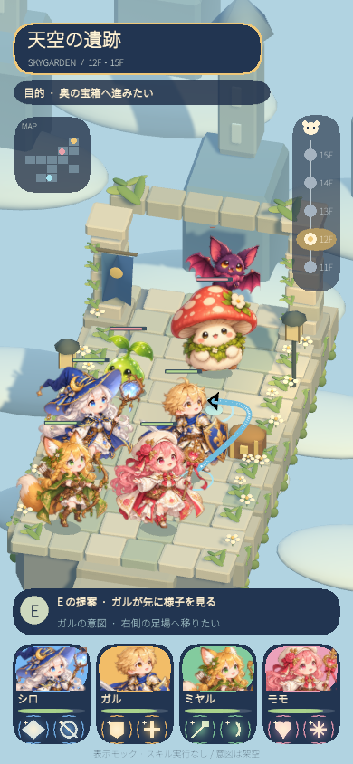

# Issue #9 — Unity visual benchmark

Contract: https://github.com/tomooch/rogue-tactics-lab/issues/9#issuecomment-6054166994

Baseline: `ab9fa5dc729dcea07f8680e7b22544627c5e5bed` (fetched origin/main).
Branch: `codex/issue-9-unity-visual`.
Editor: Unity `6000.3.25f1` on Local Mac Apple Silicon.

## Inspect / reproduce

Open `unity/` with the exact Editor, then open
`Assets/RogueTactics/Scenes/VisualBenchmark.unity`. This is an opt-in, static
fictional visual fixture; Stage0 remains the default build scene. Enter Play Mode
or inspect/edit the actual world geometry in Scene view. There are four on-board
companions and three original monsters. E is solely a compact HUD identity.

The scene contains independently rendered stone geometry, plants, flowers,
clouds, distant ruins, lanterns, a banner and chest. Its HUD has a separate
mini-map, connected 15F→11F timeline highlighting 12F, four painted character
portraits and two skill-looking motifs per card, plus a curved ground-origin
intent arrow. Goal, E proposal and companion intent are authored fictional text.
A fixture-only URP profile uses 1.0 render scale, 4× MSAA and soft shadows;
it is applied for this fixture/capture and restores the prior profile on unload.
Accepted Stage0 rendering assets and project settings remain unchanged.

No Button, pathfinding, skill execution, combat, AI, trust, leadership, timing,
ATB, resolution chunk or intent horizon is implemented.

Rebuild using **Tools → Rogue Tactics → Create Visual Benchmark**. This replaces
only the fixture scene and its own generated art. It never reads private
reference paths or changes Stage0/build settings. Reference originals are not
included or needed at runtime. Art provenance and full font license are in
`unity/Assets/RogueTactics/Art/VisualBenchmark/`.

Batch commands (substitute checkout/log/result paths):

```text
Unity -batchmode -quit -projectPath <checkout>/unity -executeMethod RogueTactics.VisualBenchmark.Editor.VisualBenchmarkSetup.CreateAndCapture -logFile <import.log>
Unity -batchmode -projectPath <checkout>/unity -runTests -testPlatform EditMode -testResults <edit.xml> -logFile <edit.log>
Unity -batchmode -projectPath <checkout>/unity -runTests -testPlatform PlayMode -testResults <play.xml> -logFile <play.log>
```

Editor capture is a real Camera/URP render to 390×844. The PlayMode fixture smoke
additionally checks scene references, on-screen actors, text extents, separate
floor/map motifs, all eight icon illustrations, field allocation and absence of
skill controls, then saves a real rendered 390×844 PNG. Pixel dimensions and
agent image review are evidence of the tested framing; they do not prove
physical-device safe-area/touch behavior or Human visual acceptance.

## Visual acceptance boundary

Technical success and an agent review are insufficient to declare the art
accepted. The Human must assess the actual Unity PNG and decide whether the
scene makes them want to play. The reference is a richly illustrated concept;
this fixture combines independently placed painted character sprites with an
original 3D diorama. Remaining fidelity differences
must be disclosed alongside the final screenshot.

No merge, Draft-to-Ready, Pages publication, paid assets/service, signing secrets,
real-device builds or human play are included. Notion Todo / Tried & Learned synchronization is recorded below once the
Draft PR and final evidence are available; no new gameplay decision is made.

## Reference protection

Read-only local inventory: one README and nine images (five full references,
four Human crops). `git ls-files -- _userwork/` was empty. Canonical checkout had
an existing user `.gitignore` edit; it was preserved. The local-only
`.git/info/exclude` now contains `/_userwork/` exactly once. The task branch adds
only the requested comment and ignore rule to its root `.gitignore`:

```gitignore
# User-owned local reference materials
/_userwork/
```

`git check-ignore -v` confirmed the real canonical README is ignored, and the
same real relative reference pathname is ignored in the task checkout without
creating/copying any reference file. No reference was tracked, staged or forced
into Git. No destructive cleanup was used.

Noto font SHA256: `c2f3b4d463500a2ddcd3849cded1fceeb9fd6d1c32e6cbecd568453ba50fc68f`.

## Adversarial visual review / remaining differences

Observed in the real saved-scene 390×844 PlayMode render:

- The field is the main subject (524/844 px layout allocation, about 62%). All
  four friends and three monsters have distinct painted faces/costumes and
  silhouettes. No capsules/boxes serve as final character art.
- The separate map and 15F→11F timeline remain visible; 12F is highlighted.
  Bat placement was moved away from the timeline. Four portrait crops and all
  eight skill motifs are present. E remains off-board. Text bounds are checked,
  and important text is not hidden/clipped in the reviewed PNG.
- Repaired during iteration: missing title due to font height, tiny portraits,
  incorrect panel import mode, stale mesh reuse on regeneration, bat/timeline
  overlap, and insufficient arrow separation from the knight sprite. The
  saved-scene PlayMode reload supplies stronger evidence than the generation
  process alone.
- **Remaining quality gap:** environment masonry/clouds are simpler and more
  regular than the reference's richly illustrated, weathered ruins; greenery,
  atmospheric depth and material detail remain less organic. Painted characters
  use one static pose and do not respond to 3D lighting like rigged models.
  Some cape/sprite overlap remains in the party formation; portrait/icon art is
  compact, and decorative floor/map text is small. The eight icon motifs are
  original simple illustrations, below the reference's detailed luminous art.
- Screen framing is tested at 390×844, not a notched physical phone. Device
  safe areas, touch legibility, GPU performance, animation, native builds,
  human play and “I want to play” acceptance remain unverified.

This is a reviewable visual candidate. It is **not** declared visually accepted,
a finished game, or a proof of the gameplay hypothesis.

## Final verified source / evidence

Tested source SHA: `a638712b7b4b4f7366c91a3b641c4bc958766f25`.
Unity import/compile PASS at this source, C# compile errors absent.
EditMode **5/5 PASS**, PlayMode **2/2 PASS**, both exit 0. PlayMode includes the
unchanged Stage0 smoke and the new saved-scene benchmark render/bounds/profile
restoration smoke. Canvas measured 390×843.9999; PNG is exactly 390×844.



`verification.json` records commands, target SHA and limits; `EditMode.xml` and
`PlayMode.xml` are actual runner results. `changed-files.txt` is the complete
baseline-to-delivery file inventory. Final evidence-only commit does not change
the tested Unity source/assets/settings; Git tree equality is checked after it.
License access-token refresh / usbmuxd diagnostics are non-blocking local Editor
messages; credentials/tokens are not included in committed artifacts. The logs
listed in verification.json are temporary local evidence, not durable storage.

Notion sources: [Todo](https://app.notion.com/p/3e3ad38889158105a09df12a35b633a7),
[Tried & Learned](https://app.notion.com/p/3e3ad388891581aba10ddf3e65a70047).
Execution/PR evidence is synchronized after Draft PR creation; Human acceptance
remains pending. No new gameplay Decision is made.
